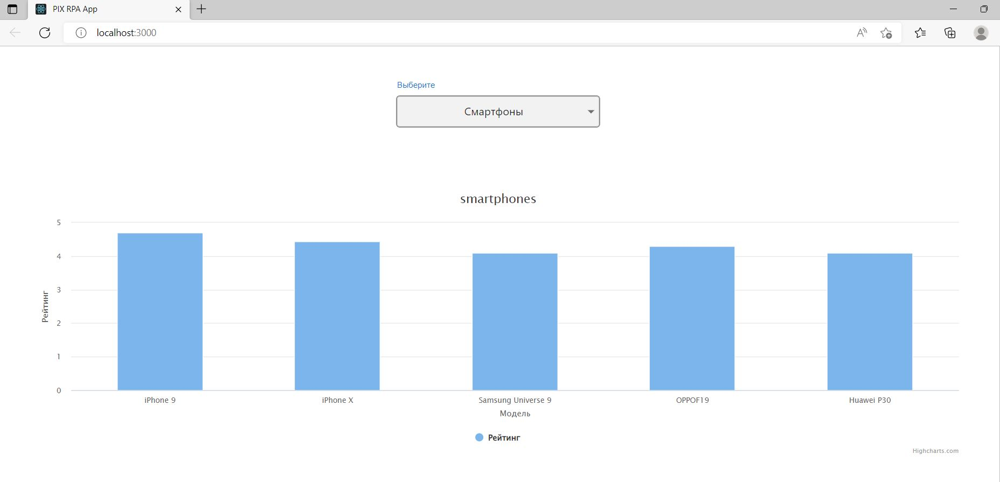
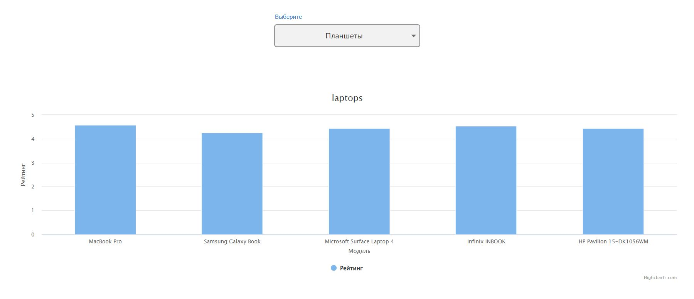

# PIXTask

<h3>Используя React + TypeScript , а также библиотеку highcharts.js, создана страница с графиком, отображающим рейтинг смартфонов\планшетов.</h3>

1. Данные берутся из API через ReduxToolkit.

2. На странице есть дропдаун - с выбором Смартфоны / Планшеты.

На странице есть график колоночный (column) - исходя из выбора взять только смартфоны / планшеты. Ось x - модель смартфона (или планшета), ось у - его рейтинг.

До получения данных от API отображется лоадер(спиннер).

